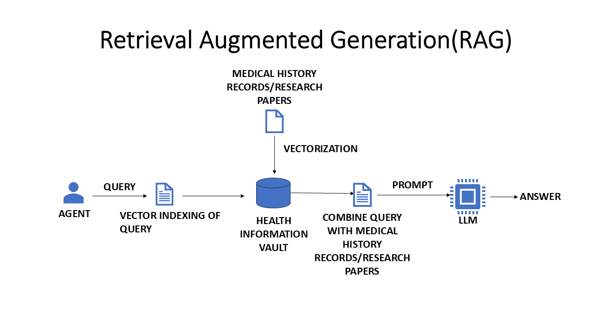
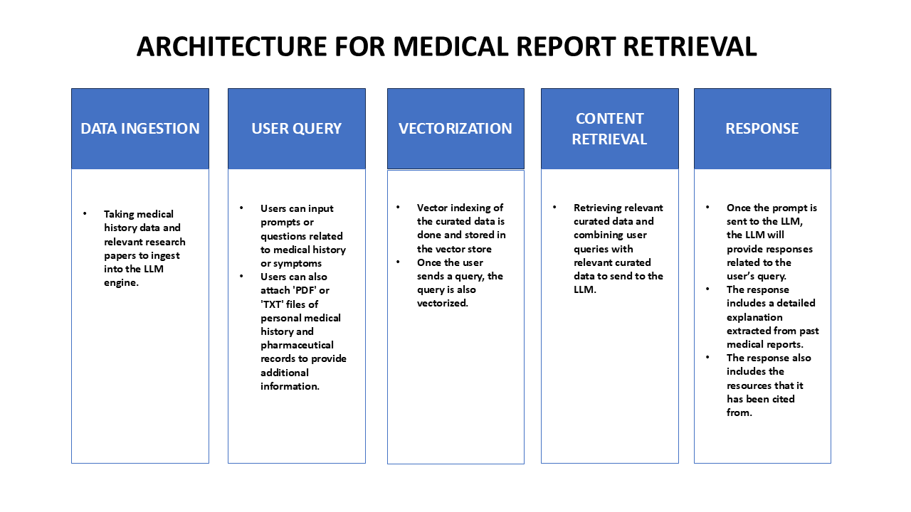

# Final Report on Retrieval-Augmented Generation Model for Healthcare Documentation

This repository contains the final report for my internship at **GlobalMedics.AI**, where I worked as a **Data Analysis Intern** from **January 2024 to June 2024**. During my internship, I developed a **Retrieval-Augmented Generation (RAG)** model to generate **pre-consultation reports** from **medical records**. The goal was to improve healthcare documentation efficiency by integrating AI-based tools for document generation.

## Report Details

- **Title:** Final Report on Retrieval-Augmented Generation Model for Healthcare Documentation
- **Author:** Aishwarya Nachiya Subramanian
- **Format:** PDF

---

## Table of Contents

1. [Overview of the Organization](#overview-of-the-organization)
2. [Organizational Structure](#organizational-structure)
3. [Plan of Your Internship Program](#plan-of-your-internship-program)
4. [Training Program](#training-program)
5. [Reflective Journal Entries](#reflective-journal-entries)
6. [Work Samples](#work-samples)
7. [Critical Analysis](#critical-analysis)
8. [SWOT Analysis](#swot-analysis)
9. [Conclusion](#conclusion)
10. [Recommendations](#recommendations)
11. [References & Sources](#references-sources)
12. [RAG Structure & Architecture](#rag-structure-architecture)

---

## Overview of the Organization

**GlobalMedics.AI** is a healthcare-focused technology company specializing in leveraging **artificial intelligence** to improve clinical workflows and documentation processes. Their core mission is to enhance medical professionals' productivity by automating administrative tasks and improving data accessibility. The organization operates in several key areas of healthcare, including:

- Medical document automation
- AI-assisted diagnostics
- Data analysis and predictive modeling

In this internship, I contributed to the development of a **Retrieval-Augmented Generation** model, which retrieves relevant documents from medical databases and generates structured reports based on the retrieved data.

---

## Organizational Structure

The structure of **GlobalMedics.AI** is centered around interdisciplinary teams working on various AI-driven healthcare solutions. The **Data Analysis Team** is integral to the company's success, ensuring data processing, analysis, and model development align with healthcare needs. Below is an outline of the key departments:

- **CEO & Executive Team:** Visionaries and decision-makers for AI strategy in healthcare.
- **Data Science Team:** Data analysts, machine learning engineers, and AI researchers.
- **Healthcare Integration Team:** Experts working to incorporate AI solutions into medical workflows.
- **Support & Operations Team:** Ensures smooth product deployment and troubleshooting.

My team was responsible for analyzing and processing healthcare data, and I worked closely with the **AI Research Team** to develop the **RAG model**.

---

## Plan of Your Internship Program

The internship was designed to offer both theoretical and practical learning experiences, with a focus on **AI** and **data science applications in healthcare**. Key objectives of the internship included:

- **Understanding Healthcare Data:** Gaining insights into the structure, privacy regulations, and challenges associated with healthcare data.
- **Model Development:** Building and refining the **RAG model** using **Azure Cognitive Services**, **LangChain**, and **Semantic Kernel**.
- **Collaboration:** Working alongside experts in data science and healthcare to create solutions that directly impact patient care.

---

## Training Program

During the internship, I received formal training and attended several workshops, including:

- **Introduction to Azure Cognitive Services:** A session on using Azure’s AI tools for healthcare applications.
- **Data Privacy & Healthcare Regulations:** Understanding compliance with healthcare privacy laws such as **HIPAA**.
- **LangChain for Data Integration:** A deep dive into using LangChain to integrate and process data for our RAG model.
- **Generative AI in Healthcare:** A specialized workshop on using **Generative AI** for creating healthcare reports.

These sessions equipped me with essential tools to contribute effectively to the RAG model development.

---

## Reflective Journal Entries

Throughout the internship, I maintained a reflective journal to document my learning, challenges, and growth. Some key insights include:

- **Adapting to Complex Healthcare Data:** Understanding the intricacies of working with structured and unstructured medical records was a steep learning curve. However, leveraging the power of **Azure Cognitive Search** to index and retrieve relevant documents helped simplify the process.
- **Collaboration Across Teams:** I learned the importance of communication and collaboration when working on multidisciplinary projects, particularly when combining AI and healthcare knowledge.
- **Generative AI's Potential in Healthcare:** I discovered the transformative power of generative AI in automating clinical documentation, making processes more efficient and reducing clinician burnout.

---

## Work Samples

As part of the internship, I produced several key work samples that demonstrate the application of my skills:

1. **RAG Model Development:** The core achievement of my internship, including the integration of a retrieval system and a generative model.
Below is an overview of the **Retrieval-Augmented Generation (RAG)** model architecture for generating pre-consultation reports:

3. **Pre-Consultation Report Generation:** Examples of AI-generated reports based on patient records.
The following flowchart shows the architecture used for the **medical report retrieval** process:

4. **Data Privacy Compliance Tools:** A Python script for automating the removal of personally identifiable information (PII) from medical documents.

The following output shows the **personally identifiable information redaction** process:

---

## Critical Analysis

A critical evaluation of the **RAG model** revealed several strengths and areas for improvement:

### Strengths:
- **Efficiency:** The RAG model significantly reduced the time required for generating accurate pre-consultation reports.
- **Scalability:** The model can handle large datasets and adapt to different medical contexts.

### Areas for Improvement:
- **Data Quality:** Inconsistent quality of input data sometimes led to incomplete or inaccurate reports. A more robust data cleaning process could address this.
- **Model Fine-Tuning:** Although the RAG model worked well, fine-tuning the generative component could improve the fluency and precision of the generated reports.

---

## SWOT Analysis

Here is a SWOT analysis based on my experience:

- **Strengths:** 
  - In-depth exposure to AI applications in healthcare.
  - Hands-on experience with **Azure Cognitive Services** and **LangChain**.

- **Weaknesses:** 
  - Limited exposure to real-world deployment challenges of AI solutions in clinical settings.
  - Some technical challenges arose when handling extremely large datasets.

- **Opportunities:** 
  - Enhancing the **RAG model** for a wider range of medical applications.
  - Potential for deeper integration of AI with clinical decision support systems.

- **Threats:** 
  - Healthcare data privacy regulations may pose challenges when scaling AI models.
  - Competition from other AI solutions in healthcare.

---

## Conclusion

My internship at **GlobalMedics.AI** was an enriching experience that significantly contributed to my understanding of AI in healthcare. The **RAG model** I developed has the potential to improve healthcare documentation workflows, making them more efficient and accurate. I gained valuable experience in both technical and collaborative aspects of working in a high-impact, multidisciplinary environment.

---

## Recommendations

Based on my internship experience, I recommend the following:

- **Improved Data Quality:** Invest in more rigorous data cleaning and preprocessing steps before applying the RAG model.
- **User Interface Development:** Develop a user-friendly interface for clinicians to interact with AI-generated reports, ensuring the system integrates seamlessly into their workflow.
- **Scalability Testing:** Conduct extensive testing to ensure the model can handle large-scale deployments and varied healthcare settings.

---

## References & Sources

Here is a list of sources and references I consulted during my internship:

1. **Healthcare AI Implementation:** Smith et al., (2022), *Artificial Intelligence in Healthcare: A Review*.
2. **LangChain Documentation:** LangChain Official Docs - [LangChain Docs](https://langchain.com/docs).
3. **Azure Cognitive Services:** Microsoft Official Docs - [Azure Cognitive Services](https://learn.microsoft.com/en-us/azure/cognitive-services/).

---

## Usage

To view the final report, download the file from this repository and open it in your preferred document viewer.

For any questions or suggestions, please feel free to reach out to me at **email@example.com**.

---

## License

This project is licensed under the [Your License] License - see the LICENSE file for details.

